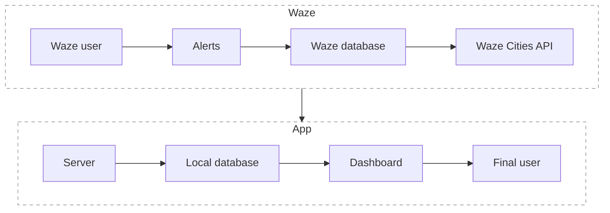

# Antofagasta Traffic Management

This is a Data-oriented project with the objective to provide a powerful tool for getting insights from traffic data in Antofagasta using the `Waze` API through its program `cities`, which provides currently active `Alerts` and `Jams`.

## Main concepts

The data is provided in `JSON` format from the API and contains `Alerts` and `Jams` events. `Alerts` represent all events reported by users and `Jams` are traffic congestion events that `Waze` calculates from average speed, quantity of vehicles, etc. This application is centered on `Alerts` events because they include both jams and user-reported alerts, and additionally provide more information, such as `ACCIDENT` or `ROAD_CLOSED` types. The complete information is available in [Waze documentation](https://support.google.com/waze/partners/answer/13458165?hl=en&ref_topic=10616686&sjid=16379543544211503448-SA).

## Objectives

- Obtain sufficient and representative data about traffic events in Antofagasta through the Waze Cities API.
- Perform a descriptive analysis of the collected data to identify relevant patterns and trends in traffic behavior.
- Identify key factors that influence road safety and traffic efficiency in the city.
- Present visually comprehensible and useful information for traffic management authorities, facilitating the implementation of data-driven policies and actions.
- Use available data to develop predictive traffic models that would allow anticipating events and making proactive decisions in traffic management.

## Architecture

The app is composed by:

- Local server
- Client (Dashboard)

---

The local server, written in Rust, is in charge of all core processes related to data extraction, transformation, and loading to local database (ETL), including cache management (`Memcached`). The server provides endpoints for interacting with the client (Dashboard).

```text
http://localhost:7000/update-data
http://localhost:7000/get-data?since={millis_epoch_time}&until={millis_epoch_time}
http://localhost:7000/aggregate
```

- `update-data`: `GET` - endpoint retrieves data from the API, transforms it, saves to database and cache. Then returns the retrieved and transformed data in the `HTTP` response.
- `get-data`: `GET` - endpoint that provides data from cache if available or from the database, with parameters `since` and `until` which indicate the period of `pub_millis` (publication date) in epoch time and milliseconds.
- `aggregate`: `POST` - endpoint for transforming data from native API form to aggregated and transformed data. The request body should contain the alert data in a `JSON` with the key `alerts` containing a list of all the correct `alerts` data.


---

The client (dashboard), written in Python, is in charge of retrieving data from the local server, deploying the dashboard, listening for callbacks and updates, and training/deploying the Machine Learning model.



